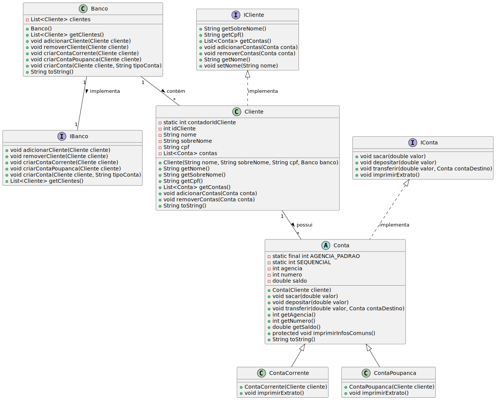

# Simulação Bancária - Projeto Prático de POO

Este é um projeto de simulação bancária implementado em Java, com o objetivo de testar e demonstrar o uso de conceitos de Programação Orientada a Objetos (POO), como herança, polimorfismo, encapsulamento e interfaces. O sistema simula um banco com clientes e suas contas (corrente e poupança), permitindo a realização de transações como depósitos, saques e transferências.

## Objetivo

O principal objetivo deste projeto é colocar em prática os conhecimentos de POO, criando um sistema simples de banco onde:

- O **Banco** contém **Clientes**.
- Cada **Cliente** pode ter várias **Contas** (Conta Corrente e Conta Poupança).
- O sistema permite operações como **saque**, **depósito**, **transferência** e a impressão de extratos.

## Funcionalidades

- Adicionar e remover clientes no banco.
- Criar contas correntes e poupança para os clientes.
- Realizar transações de depósito, saque e transferência entre contas.
- Exibir extratos das contas com as informações de cliente, saldo e transações.

## Estrutura do Código

- **Banco**: Representa o banco, gerencia a lista de clientes e a criação de contas.
- **Cliente**: Representa o cliente bancário, com informações como nome, sobrenome, CPF e contas associadas.
- **Conta** (classe abstrata): Representa as contas bancárias (corrente e poupança), com métodos para operações bancárias.
- **ContaCorrente e ContaPoupanca**: Implementações específicas de tipos de conta com extração do extrato.
- **IConta e IBanco**: Interfaces que definem os métodos obrigatórios para as classes de contas e banco, respectivamente.

## Diagrama UML

O diagrama UML abaixo ilustra a estrutura do sistema, incluindo as relações entre as classes e interfaces:



## Expected Output

Aqui está o exemplo de saída esperada ao executar o programa:
```bash
===Extrato Conta Corrente===
Cliente: Alejandro
Agencia: 1
Conta número: 1672
Saldo: 0,00
============================
===Extrato Conta Poupanca===
Cliente: Alejandro
Agencia: 1
Conta número: 1673
Saldo: 0,00
============================
============================
Depositando: 100,00 Para a conta: 1672
============================
Sacando:  25,00
============================
Alejandro Tranferiu: 23,00 Para a conta: 1673 de Alejandro
============================
Depositando: 23,00 Para a conta: 1673
===Extrato Conta Corrente===
Cliente: Alejandro
Agencia: 1
Conta número: 1672
Saldo: 52,00
============================
===Extrato Conta Poupanca===
Cliente: Alejandro
Agencia: 1
Conta número: 1673
Saldo: 23,00
============================
============================
Depositando: 160,00 Para a conta: 1674
============================
Jâo Tranferiu: 50,00 Para a conta: 1672 de Alejandro
============================
Depositando: 50,00 Para a conta: 1672
===Extrato Conta Corrente===
Cliente: Jâo
Agencia: 1
Conta número: 1674
Saldo: 110,00
============================
===Extrato Conta Corrente===
Cliente: Alejandro
Agencia: 1
Conta número: 1672
Saldo: 102,00
============================
Informação do cliente
Conta{agencia=1, numero=1672, saldo=102,00}
Clientes no banco:
Cliente{idCliente=1, nome='Alejandro', sobreNome='Garcia', cpf='12312321', contas=[Conta{agencia=1, numero=1672, saldo=102,00}, Conta{agencia=1, numero=1673, saldo=23,00}]}
Cliente{idCliente=2, nome='Jâo', sobreNome='Pedro', cpf='23423', contas=[Conta{agencia=1, numero=1674, saldo=110,00}]}
```


